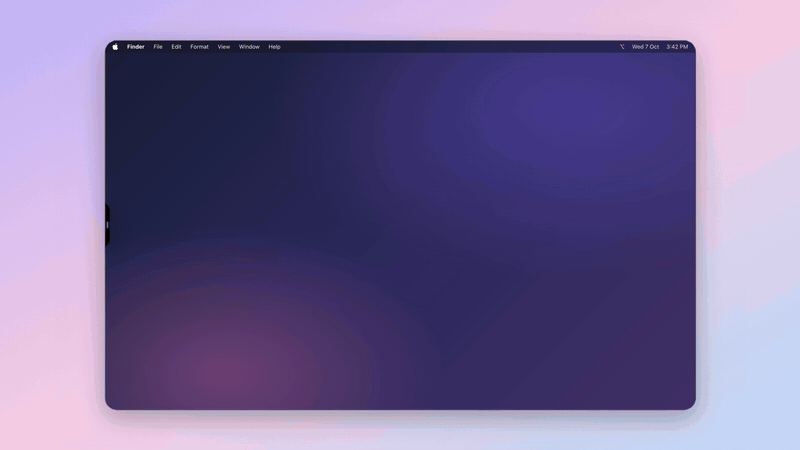

<div align="center">

# Edith

**A personal AI agent that remembers you, talks to you, and does the work on your Mac, your inbox, and your calendar.**



*One sentence: Eddy opens the browser, researches, and writes sourced notes into TextEdit.* · [Watch the MP4](docs/media/eddy-demo.mp4)

</div>

---

Most assistants start every conversation from zero. Edith is built for one person over the long
haul: it keeps durable memory of facts and past conversations, runs jobs on a schedule, and acts
across your apps. Anything that sends, posts, or submits waits for your approval.

## What it does

| | |
|---|---|
| 🧠 **Remembers** | Durable facts, full conversation history with keyword search, and semantic recall over a vector DB. |
| 🎙️ **Talks** | Hold <kbd>⌃</kbd> to talk to **Eddy**, a notch on the edge of your screen. She speaks back. |
| 🖥️ **Uses your Mac** | Drives apps through the Accessibility tree and browser pages through the DOM. Asks before sends and submits, and stops when you take over. |
| 📬 **Works your accounts** | Gmail, Drive, Calendar, Docs, Sheets, WhatsApp, GitHub, Vercel, and any MCP server you add. |
| ⏰ **Runs on its own** | Reminders, recurring jobs, nightly reflection, a job-application pipeline, and a LinkedIn content engine, all on Temporal. Each one is opt-in. |
| 🔎 **Researches** | `deep_research` breaks a question into sub-questions, searches each one, and writes a sourced answer. |
| 📊 **Watches itself** | Every LLM and tool call is traced with cost and latency. An eval harness scores its answers (its first run caught a real hallucination bug). |

## Clients

| Client | Stack | |
|---|---|---|
| **Eddy notch** (`edith-widget/`) | Swift, macOS | Voice notch on the left screen edge. Starts the local server so macOS permissions cover it. |
| **Web app** (`edith/web/`) | Vanilla JS PWA | Chat, Goals, Todos, Jobs, Content, Insights, MCP tabs. Served by the API. |
| **Android** (`edith-android/`) | Capacitor | Mobile chat and push notifications. |
| **Desktop widget** (`edith-desktop/`) | Electron | Always-on-top voice widget. |
| **Dashboard** (`edith-dashboard/`) | Next.js | Traces, spend, evals, goals. |

## Quick start

```bash
git clone https://github.com/techwarq/Edith.git && cd Edith
python3.11 -m venv .venv && source .venv/bin/activate
pip install -e .
cp .env.example .env        # add the keys for the integrations you want

python main.py                          # terminal chat
uvicorn edith.server:app --reload       # API + web app at http://localhost:8000
```

Only an LLM key is required. Every integration is optional and reports "not configured" instead
of crashing at startup.

<details>
<summary><b>Build the Eddy notch (macOS)</b></summary>

```bash
cd edith-widget && ./build-app.sh
```

Grant Accessibility, Screen Recording, and Microphone when the notch asks. Shortcuts: hold
<kbd>⌃</kbd> to talk, <kbd>⌃</kbd><kbd>⌘</kbd> to type, <kbd>Esc</kbd> to stop.
</details>

## How it works

```
             ┌──────────── clients ─────────────┐
             │ Eddy notch · Web · Android · CLI │
             └────────────────┬─────────────────┘
                              │ SSE
                    ┌─────────▼──────────┐
                    │  FastAPI server    │
                    │  agent tool loop   │──── Temporal (scheduled jobs)
                    └─────────┬──────────┘
          ┌───────────────────┼────────────────────┐
     ┌────▼─────┐       ┌─────▼──────┐       ┌─────▼──────┐
     │  Memory  │       │   Tools    │       │  Approval  │
     │ SQLite + │       │ Mac, Google│       │   queue    │
     │ FTS5 +   │       │ WhatsApp,  │       │ (sends and │
     │ Qdrant   │       │ web, MCP…  │       │  submits)  │
     └──────────┘       └────────────┘       └────────────┘
```

- **Agent loop**: OpenRouter tool calling (default `qwen/qwen3.7-flash`, change it with
  `EDITH_MODEL`), with retry/backoff, an iteration cap, and context trimming for long tool chains.
- **Memory**:
  - Working memory: the last 40 turns of the conversation.
  - Durable facts: a user profile with categories.
  - Exact recall: SQLite FTS5 over all history.
  - Semantic recall: Gemini embeddings in Qdrant.
- **Mac control**: a decider model picks each step from a text table of on-screen elements. A
  vision model is used only as a one-step fallback. Sends and submits need confirmation, stop
  stays in effect until you resume, and runs have time and step limits.
- **Autonomy, gated**: every scheduled job is opt-in and safe to re-run. Anything that leaves your
  machine (email, WhatsApp, applications, posts) waits in an approval queue.

<details>
<summary><b>Repository layout</b></summary>

```
edith/
├── server.py, cli.py, agent.py, bootstrap.py, prompts.py
├── llm/               OpenRouter tool-calling loop
├── memory/            SQLite (facts, FTS5 history) + Qdrant semantic recall
├── tools/             LLM tools by domain: growth/, ops/, productivity/, search/, system/
├── integrations/      voice, WhatsApp, browser, push, google/, linkedin/
├── computer_use/      Accessibility + DOM perception, step-by-step Mac operator
├── job_applications/  Job-search and apply pipeline
├── temporal/          Scheduled and recurring workflows
├── observability/     Tracing, spend, evals
└── goals/, todos/, mcp/, monitor/, web/

edith-widget/     Eddy notch (Swift)
edith-desktop/    Electron widget
edith-android/    Capacitor app
edith-dashboard/  Next.js dashboard
tests/            pytest suite
```
</details>

## Tests and deploy

```bash
pytest        # 368 tests
```

Deploys to Railway with the included `Dockerfile`.

## License

[MIT](LICENSE)
